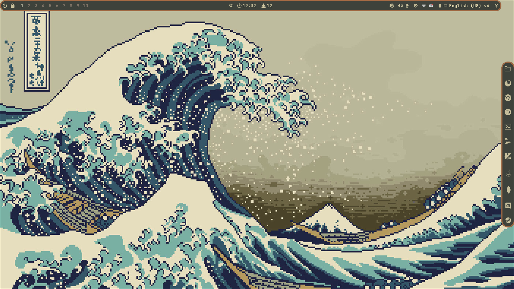
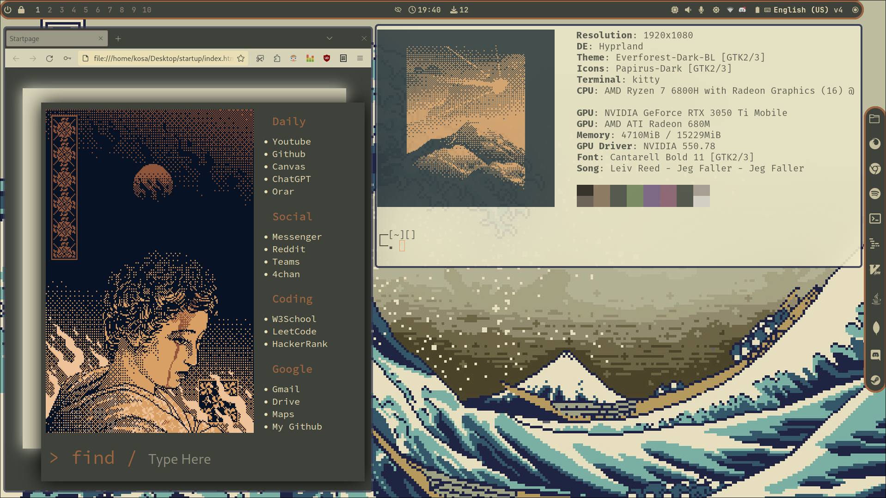

# Hyprland

### Basically, i started with https://github.com/SolDoesTech/HyprV4 and modified that till i got this

### So shoutout to SolDoesTech!!!

### The startup page for the browser is inspired by https://github.com/Nainish-Rai, also shoutout to him!

# If you like it, give it a star!

# I will answer to any question in the `issues` section, so be brave and use it

## If you like it, you can support me here:

